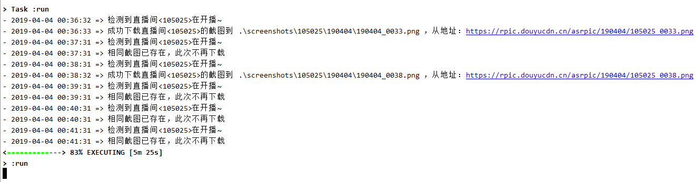
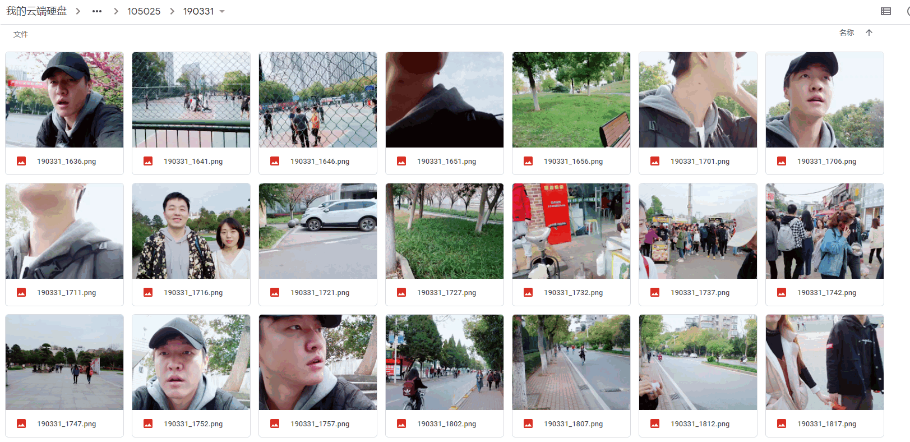

# douyu-screenshot-downloader
斗鱼直播间截图（直播封面）检测下载工具。（ JVM 版 ）

## 简介

- 按照设置的时间间隔周期性地探测下载斗鱼特定直播间的直播画面截图；
- 下载后的直播截图按照直播间号、截图日期和时间归类命名处理：
  - 默认规则：直播间号 `12345` 在 `2019年4月4日01:30` 的截图放置路径： `screenshots/12345/190404/190404_0130.png`
- JVM 版，使用依赖于 JDK 8 或更高版本；
- 用 Kotlin 编写

## 依赖

JDK 8 或更高版本

## 使用

1. Clone 或者下载该项目：

   ```bash
   git clone https://github.com/yanzai/douyu-screenshot-downloader.git
   ```

2. 配置 `src/main/resources/config.json` :

   ```json
   {
     "room_id": "105025",
     "interval_seconds": 60
   }
   ```

   其中：

   - `room_id` : 要下载截图的直播间号码
   - `interval_seconds` : 检测下载最新截图的时间间隔，单位：秒，60是一个比较合理的值

3. 运行程序，在项目根目录下执行：

   - Win :

     ```bash
     gradlew.bat clean run
     ```

   - Liunx :

     ```bash
     ./gradlew clean run
     ```

## 效果

### 程序输出示例



### 截图归类存储示例

